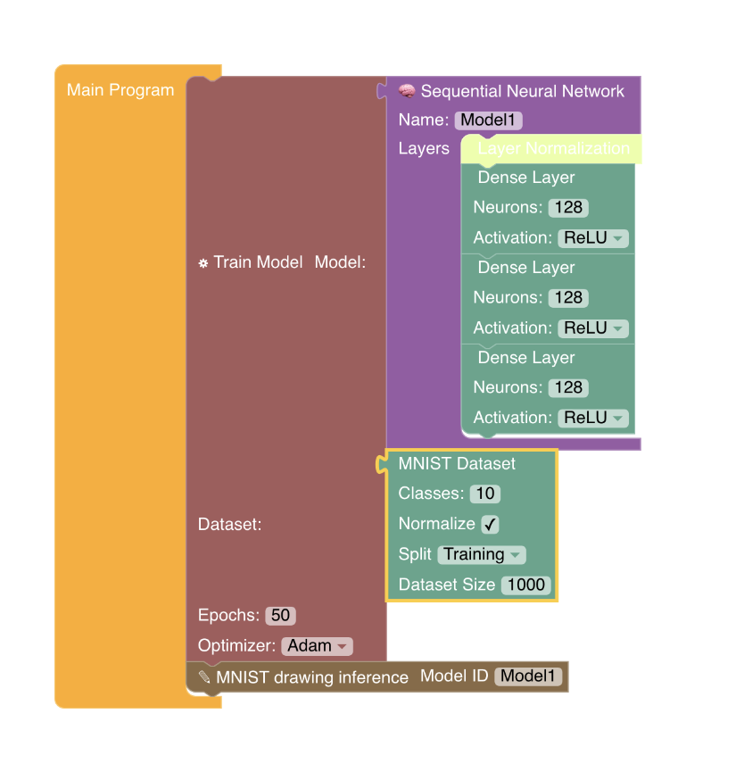

# Project Neural Network Lab

[](https://GitHub.com/Naereen/StrapDown.js/graphs/commit-activity)

[](Server_Status)


---
A blockly based (*Scratch-style engine*) that allows you to run neural network models and customize it based on blockly blocks. It uses NPM and runs *Tensorflow.JS* in the browser, making demos very easy. See the demo [here](https://ra86-dev.github.io/project_NN_Lab/). Its run on Github Pages using a Github Actions workflow that autocompiles. **I recommend that you read this README before you go to the project**. This was made for Stardance Hackclub (*2026-2027*). (NOTE: The CDN used in this project is from Stardance! if it is no longer available, please modify src/mnist.jsx and replace the link with the on from loremh below).


*NOTE: I used lorenmh/mnist_handwritten_json* in this project. You can view that repository [here](https://github.com/lorenmh/mnist_handwritten_json).

**NOTE:** Due to memory restrictions in the browser, do not expect large datasets to perform very well in the browser. This is due to browser restrictions from the browser's memory restrictions and how much memory you have. However, we have swapped to Web Workers, meaning that training is performed on a seperate "worker" to prevent the other workers (Including the frontend) from lagging.
## Features
Currently, the following has been added:
- Blockly Engine
- Sequential Neural Network 
- A Chart for neural network weight values + Built in presets
- WebGPU/WebGL support! 
    - Web Workers!
- Multiple Layers:
    - GRU
    - Dense Layers
    - Activation Layer
    - Conv2d Layer
    - Maxpooling2d Layer
    - Dropout Layer
    - AlphaDropout
    - GlobalAveragePooling2D
    - Reshape
    - LeakyReLU
    - Embedding Layer
    - LSTM Layer
    - Flatten Layers
    - Multi-Head Attention
    - Gaussian Noise
- Normalization Layers
    - BatchNormalization
    - LayerNormalization
- Types of Neural Networks:
  - Mixture of Experts 
  - Sequential
- Two Datasets:
    - MNIST (**VERY LAGGY**)
    - Synthetic Math Dataset Generator
    - JSON Datasets acceptable through a new block.
## Requirements
- NodeJS
- npm

<details>
<summary>Installation Instructions</summary>
<h2> Installation </h2>

```bash
git clone https://github.com/RA86-dev/project_NN_Lab
cd project_NN_Lab/Project\ Neural\ Network\ Lab/ 

npm install 
npm run dev # Development is for non-production grade (like testing)
# FOR PRODUCTION:
npm run build
npm run start
```
</details>


## License
Licensed under ISC/MIT [here](LICENSE)
## AI Use Declaration
In this project, AI was used for the user interface and debugging issues along with writing some functions. It was not used to write documentation.
## Example Image
<p align="center">
  
</p>

## Getting Started Guide (How to Use)
Hello! This is a guide on how to use my project.
The goal of this project is to simplify AI models and training, so it doens't overwhelm people while still allowing them to build what they want and experiment (and break stuff). To start, all you need to do is head to the Basic Blocks section, pull a main Program block, and then add a train and inference. Choose a dataset, and you can get started with designing your system. Note, you might need a lot of Neural network knowledge to use this, however, its made to make it easier to understand and build scripts to train and experiment with AI models.
### Vocabulary
Every "fancy" word is listed here, along with a simplified definition.
- Model - the neural network. A neural network in this case, is basically a artificial version of the brain network structure.
- Activation Layer - A mathematical formula inside of a neural network. It decides whether the node should fire, or to pass the signal. It basically just adds nonlinearity.
- Conv2d - Conv2d is a neural network architecture style, that basically identifies patterns in a 2d shape (thats where the "2d" in the name comes from). Its goal is to basically spot potential patterns, so its used for neural networks to be able to identify patterns. Conv meaning Convolution, Convolution uses a sliding layer to identify patterns.
- Dense Layer - A dense layer is basically a layer where everything is connected. In some other architectures, such as MoE (Mixture of Experts), not all parameters are connected to make it more efficient. This is the most common block used in AI and Machine Learning.
- Dropout Layer - This layer effectively turns off a certain percentage of connections. This is used for testing models or to train models to be more compressed. DURING TRAINING. In actual inference, it does not do this.
- GRU - GRU means Gated Recurrent Unit. It is a simpler version of a LSTM, and has "gates" to control things like how much past information to keep for the future, how much to forget, and a hidden state to merge the short term and long term memory into one. For LSTM and GRUs, you need to turn on return sequences for if there are more layers underneath it.
- Recurrent Neural Network (RNN) - A model that processes data by repeatedly updating a internal state.
- LSTM - A special form of a Recurrent Neural Network designed to remember information over long sequences. Traditional RNNs suffer from the vanishing gradient problem, which basically means that it forgets short term data, however, this one does not. However, these are slower than Traditional RNNs.
- Embedding Layer - A layer which basically converts each word into a token for the AI model. This is useful for Transformers, which is used in large LLMs (Generative* AI models).
- MaxPooling2D - Downsamples the input using the maximum value. Its used to shrink spacial dimensions while keeping the most "dominant" features and decrease computation times.
- Sequential Neural Network - A model that goes in order of each layer.
- Normalization - This basically shrinks all of the data to a common range, to prevent large features from overpowering smaller features.
- Batch Normalization - Standardizes the inputs to each layer of a neural network.
- Layer Normalization - Instead of normalizing across a batch of data (Batch Normalization), it calculates the mean and variability across the features of a training example.
- MNIST dataset - The MNIST dataset is a 70,000 images dataset of data classification. It contains handwritten numbers, and the model must identify what number is it. It is useful for testing new structures. (NOTE: Do not load more than ~5,000 though. That causes a lot of lag.)
- Alpha Dropout - A variation of dropout that maintains the mean and variance of the inputs, designed for self-normalizing networks (like SeLU!)
- GlobalAveragePooling2D - Calculates the average value for each feature map, replacing the heavy Flatten and Dense layer to reduce model parameters.
- LeakyReLU - A activation function based on ReLU that solves a issue of dead neurons by letting a tiny, non-zero signal pass through when inputs are negative.
- Reshape - Alters the dimensions of a input tensor without changing the data.

Here's a example model:


This is how you configure a normal neural network model. In this case, we are using MNIST, not the math dataset (which can literally just use one neuron but thats for fast testing). In the SNN model, we define the name (which is used for inference as shown by the MNIST brick) and 3 dense layers after that. 
#### Basic Activation Definitions
- Activation - An activation function is a mathematical rule used in ANNs to decide if a neuron should fire or pass information.
    - ReLU - A commonly used function for activations. Its easy and quick. 
    - Sigmoid - A mathematical formula that converts a number between 0 and 1, where 0 is equal to negative infinity and 1 is equal to infinity. Good for probabilities and predictions.
    - Softmax - A function that turns a list of unconstrained numbers into a valid set of probabilities. Good for problems where you want to generate a list of predictions.
    - Tanh - A non-linear activation function that maps input values to a curve ranging strictly between -1 and 1. Due to this, the mean of averages is around 0, which helps models converge faster than Sigmoid.
These are the most commonly used activations. Some are better than others for certain tasks, some worse for certain tasks.
## Documentation Page
[Visit Here to see documentation](docs/README.md)
- [Issue Reporting](docs/issue_reporting.md)
- [AI Rules](docs/ai_rules.md)
- [Extension Documentation](docs/extension_building.md)
