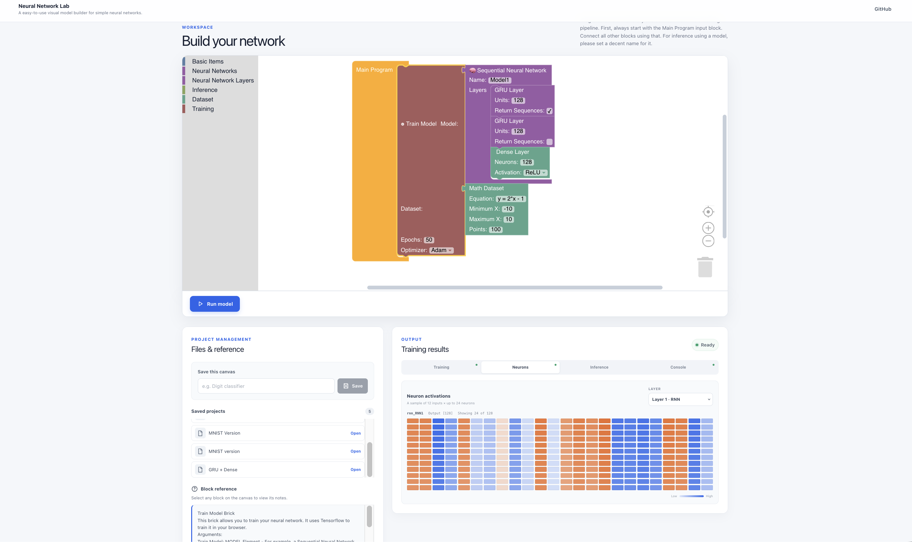

# Project Neural Network Lab
A blockly based (*Scratch-style engine*) that allows you to run neural network models and customize it based on blockly blocks. It uses NPM and runs *Tensorflow.JS* in the browser, making demos very easy. *NOTE: I used lorenmh/mnist_handwritten_json* in this project. You can view that repository [here](https://github.com/lorenmh/mnist_handwritten_json).

**NOTE:** Due to memory restrictions in the browser, do not expect large datasets to perform very well in the browser. This is due to browser restrictions from the javascript engine, and device RAM.


## Features
Currently, the following has been added:
- Blockly Engine
- Sequential Neural Network 
- Two Layers:
    - GRU
    - Dense Layers
- Two Datasets:
    - MNIST (**VERY LAGGY**)
    - Synthetic Math Dataset Generator
## Requirements
- NodeJS
- npm
## Installation
```bash
git clone https://github.com/RA86-dev/project_NN_Lab
cd project_NN_Lab/Project\ Neural\ Network\ Lab/ 
npm install 
npm run dev 

```
## License
Licensed under MIT [here](LICENSE)
## Example Image

